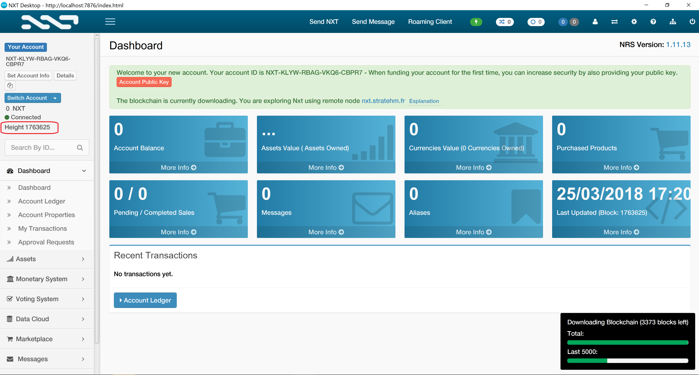

# Proof-of-Stake-Cryptocurrency-generator
Create your own Proof of Stake cryptocurrency with its own blockchain based on "Nxt Blockchain Creation Kit".
It should satisfy the requirements of the Jelurida Public License version 1.1 for the Nxt Public Blockchain Platform.
Basically 10% of your tokens should be given to the owners of the Nxt Cryptocurrency.

This generator will assist you building your NXT clone.
If you are an advanced user follow directly the official tutorial:
* Nxt-clone-starter: https://bitbucket.org/Jelurida/nxt-clone-starter
* Introduction to the NXT Blockchain Creation Kit: https://www.youtube.com/watch?v=6Wg3uv07GU4

## Requirements
* Java
* NodeJS
* Yarn

### How to install Java
* General - Java 8
* Ubuntu - http://www.webupd8.org/2012/09/install-oracle-java-8-in-ubuntu-via-ppa.html
* Debian - http://www.webupd8.org/2014/03/how-to-install-oracle-java-8-in-debian.html
* FreeBSD - pkg install openjdk8

### How to install NodeJS
* General - https://nodejs.org/en/download/

## Step 1 - Download the Nxt blockchain and create the genesis block
1. Clone this repository with `git clone https://github.com/sandoche/Proof-of-Stake-Cryptocurrency-generator`, also feel free to fork this repository!
2. Go to the cloned folder and install the npm dependencies with `npm install`
3. Run the Nxt Blockchain with `npm run step-1:nxt:run`
4. The Nxt wallet will open, create an account and save the private keys securely, wait until the full blockchain is synced, this can take a few hours. Copy your nxt address and also its public key.
5. Open the file `docs/config/newGenesisAccounts.json`, this file will define the repartition of the coins your are creating. On the first block creation 1 billion of coins will be distributed, 10% of them will be distributed to the Nxt holders (this is part of the Jelurida Public License). You have to put the list of accounts you want to credit in the first block (the genesis block) and its matching public key. The total of the amounts should be 90000000000000000 if you don't know what to do, just put your NXT address your created (Step 1-4), and it's public key like this and save it. If you are not sure about what you are doing check this video: https://www.youtube.com/watch?v=6Wg3uv07GU4
```
{
    "balances": {
         "my nxt address here": 90000000000000000
     },
     "publicKeys": [
         "the public key of this nxt address"
     ]
 }
```
6. Go to http://localhost:7876/test?requestTag=ADDONS click on "downloadJPLSnapshot" then upload your file "newGenesisAccounts.json" and copy paste the height you can see in your wallet as in the screenshot below, then submit. A file will be generated after a few minutes, save it as "genesisAccounts.json" in the `templates/conf/data` folder.

7. Create another account, and save its public address in the file `templates/conf/data/genesisParameter.json`, also edit the epochBeginning with the current date.
8. Now (or later) delete the nxt blockchain with `npm run step-1:nxt:delete` after closing the wallet

## Step 2 - Create your own Cryptocurrency
1. Update the images from `templates/img` according to your blockchain images
2. If you want the experimental wallet electron update the images that you can find in `templates/wallet-electron` and `templates/wallet-electron/build`
3. Then just run `npm run step-2:generate` and answer the generator's questions. The generator will clone the nxt-clone-starter, change the port and name in the source code and then compile it
4. Once the cryptocurrency generated you can of course edit the interface inside the `<yourCrypto>/html` folder and find the java source in `<yourCrypto>/src/java`, note that you can find many parameters that you can edit in the following file `<yourCrypto>/src/java/nxt/Constants.java`

## Step 3 - Create the executable wallet files (optionnal)
The wallet-electron is a wrapper, that allows you to quickly create an executable file for your wallet.
It's experimental and does not work very well. Feel free to improve it.
* To start development mode: `yarn start` after indeed `yarn install`
* To build run: `yarn dist:mac`, `yarn dist:win`, `yarn dist:linux` or `yarn dist` (to create all the build)

## Step 4 - Host your nodes in some servers
Once your cryptocurrency ready for deployement, you need to host some nodes online. These nodes will share the transactions with other nodes, validates transactions, and forge blocks.
You can do that in any virtual machine, you can use for example Amazon Web Services, or OVH. Once you have your virtual machine. Here is how to do:
1. Connect to the machine, I recommend Ubuntu or Debian
2. Clone your cryptocurrency
3. Install java
4. Open as an Inboud TCP Port the "Peer port" that you chose when you run the generator, you can find it also in the `<yourCrypto>/src/java/nxt/peer/Peers.java` as `DEFAULT_PEER_PORT`
5. Run `screen` and run the node with `sh ./run.sh` after  `sh ./compile.sh` or just run `java -jar <yourCrypto>.jar`
6. You now need to run the forging mode of your node, in order to do that you can either do in command line following this: https://bitcoin.stackexchange.com/questions/46628/set-a-public-node-to-auto-forge-mine-stake-in-nxt-ardor-without-login-via
If the command line to launch forging does not work you can do it with the GUI after, installing a vnc server check the following links:
* https://medium.com/@Arafat./graphical-user-interface-using-vnc-with-amazon-ec2-instances-549d9c0969c5
* https://www.digitalocean.com/community/tutorials/how-to-set-up-vnc-server-on-debian-8

## Buy me a beer
If you like this project, feel free to donate:
Bitcoin: 19JiNZ1LkMaz57tewqJaTg2hQWH4RgW4Yp
Ethereum: 0xded81fa4624e05339924355fe3504ba9587d5419
Monero: 43jqzMquW2q989UKSrB2YbeffhmJhbYb2Yxu289bv7pLRh4xVgMKj5yTd52iL6x1dvCYs9ERg5biHYxMjGkpSTs6S2jMyJn
Paypal: https://www.paypal.me/kanbanote
